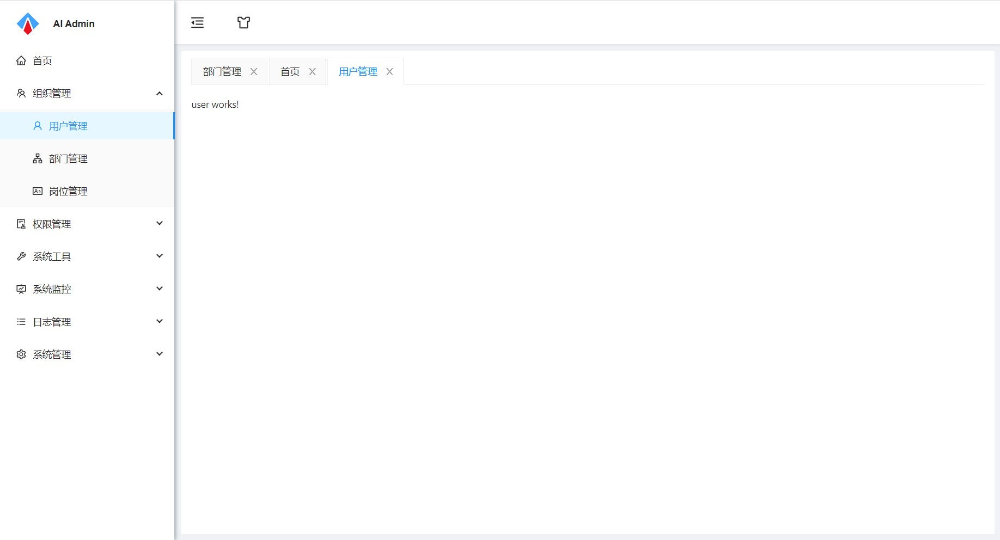
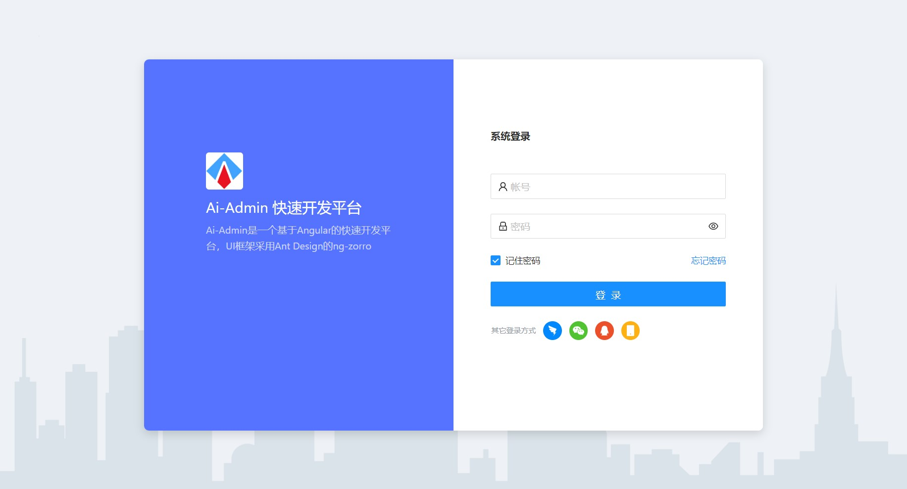

# Ai-Admin

### 平台简介：
Ai-Admin是使用Angular开发的快速开发平台，我们注重极致的用户体验和更高效率的迭代开发，UI简洁大方，技术紧随前沿。

### 核心依赖

| 依赖                   | 版本         |
| ---------------------- |------------|
| angular            | 13.1.0      |
| ng-zorro-antd           | 13.4.0   |

### 时间线
2022-08-22 登录模块实现，添加路由守卫，未登录禁止跳转 [(Angular中使用JWT)](https://mp.weixin.qq.com/s?__biz=MzkxMjE3NzM2OQ==&mid=2247484059&idx=1&sn=58dc15ca9964897418ac3c784b6c805f&chksm=c111a32df6662a3b9af4402493759a556ccf53ea1ce867d3b83ca0c23c06feb957eaec0a27e3&token=827518209&lang=zh_CN#rd)

2022-08-16 框架搭建 [(angular + ng-zorro通过路由重用实现Tab页签)](https://mp.weixin.qq.com/s?__biz=MzkxMjE3NzM2OQ==&mid=2247484051&idx=1&sn=c538af5ccd9a68f494870252f3b1ae9f&chksm=c111a325f6662a33deffa34ee0f738b0ef6ea155f148182a31d2a5c24daeb7028c1a18fadad7&token=827518209&lang=zh_CN#rd)

### 开源共建
欢迎各位大牛提供各种建议，代码编写不合理欢迎指正。

### 系统截图
UI框架：

登录页：

